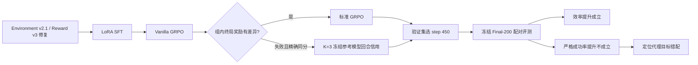

# Shopping GRPO

面向长程购物 Agent 的端到端后训练、信用分配与可审计评测项目。

本项目完成了一条固定工作流：

```text
Baseline → SFT → GRPO → Evaluation
```

运行时契约固定为 ShopSimulator Environment v2.1、Reward v3、observation v2
和 tool schema v2。项目重点不是宣称一个新的通用 RL 算法，而是回答一个更具体的
工程与研究问题：当 GRPO 因组内奖励完全相同而丢弃大量 rollout 时，能否用保守的
回合级信用信号挽救这些零梯度失败组？

[English](README.en.md) · [项目罗盘](docs/project-compass.md) ·
[复现实验](docs/reproducibility.md)

## Fork 与个人贡献

本仓库 fork 自
[`YYHDBL/shopping-grpo-longhorizon`](https://github.com/YYHDBL/shopping-grpo-longhorizon)，
实验开发起点为 commit `dc6c9af8e48c8e6325101b39d1d20060f69e4221`。

本 Fork 的主要工作包括 Environment v2.1 / Reward v3 运行时修复、SFT → 在线 GRPO
训练链路、动态采样与诊断、TRACE-inspired failure-only 回合信用、LoRA 导出身份故障
定位，以及 Final-200 配对统计和负结果分析。上游归属与本 Fork 的新增贡献通过 Git
历史和分模块 commits 保持可审计。

## 一句话结论

LoRA SFT 建立了主要购物能力；Vanilla GRPO 在 200 题冻结测试集上只有小幅且不显著的
提升。本文实现的 **TRACE-inspired exact-tie failure-only turn credit for Shopping
GRPO** 将同等训练量所需的生成轨迹减少 20.4%，但没有带来可统计支持的最终成功率
提升。轨迹分析表明，目标字符串的可预测性并不等于满足预算、规格、页面状态与动作
合法性的购买就绪度。

## 项目罗盘



完整的问题、假设、方法边界、证据链和后续设计见
[项目罗盘与技术叙事](docs/project-compass.md)。

## 核心贡献

1. 修复并验证 ShopSimulator SFT → 在线 GRPO → 冻结评测流水线，保持 Reward v3
   为唯一权威终局信号。
2. 诊断 Vanilla GRPO 的采样浪费：2,270 个生成组中 47.8% 为恒定奖励组，最终只有
   1,000 个组参与更新。
3. 将冻结参考模型、log-ratio 和 K 步前缀变化改造成保守的 failure-only 分支；只处理
   有效、无成功且精确同分的组，其他组保持 Vanilla 行为。
4. 发现并修复 veRL LoRA 导出后错误服务未合并基座的问题；此前“三模型结果完全相同”
   的评测无效，最终结果均来自正确独立合并和服务的模型。
5. 完成 Final-200 的确定性配对评测和逐轨迹负结果分析，区分“训练采样效率”与
   “任务质量”。

## 权威实验结果

三种模型使用相同 200 个任务，每题一次确定性 rollout：`temperature=0`、
`top_p=1`、`max_steps=35`、上下文 24,576、无压缩。600 条轨迹全部完成，且
`reward_valid=true`。

| 模型 | 严格成功 | Mean Reward v3 | Weighted score | 平均步数 | Guard 拒绝 |
|---|---:|---:|---:|---:|---:|
| SFT | 123/200 = 61.5% | 0.465843 | 0.750899 | 8.115 | 24 |
| Vanilla GRPO step 450 | 126/200 = 63.0% | 0.490607 | 0.747704 | 7.540 | 61 |
| TRACE failure-only step 450 | 123/200 = 61.5% | 0.464110 | 0.748079 | 7.950 | 32 |

配对统计：

- Vanilla vs SFT：`+1.5 pp`，9 gain / 6 loss，exact McNemar `p=0.607`；
- TRACE vs Vanilla：`-1.5 pp`，3 gain / 6 loss，exact McNemar `p=0.508`；
- TRACE vs SFT：`0 pp`，4 gain / 4 loss，exact McNemar `p=1.0`。

因此不能声称 Vanilla 或 failure-only TRACE 在 Final-200 上显著提升严格成功率。

## 训练采样效率

两条 GRPO 臂均完成 500 次优化更新，均训练 1,000 个组 / 4,000 条轨迹。

| 指标 | Vanilla | TRACE failure-only | 变化 |
|---|---:|---:|---:|
| 生成组 | 2,270 | 1,806 | -20.4% |
| 生成轨迹 | 9,080 | 7,224 | -20.4% |
| 生成/训练组比 | 2.270 | 1.806 | -20.4% |
| 训练利用率 | 44.05% | 55.37% | +11.32 pp |
| 跳过的更新尝试 | 56 | 17 | -69.6% |

这是生成利用率改进，不等价于 20.4% 的 wall-clock 或 GPU-hour 节省；TRACE 还引入了
参考模型评分成本。

## 方法边界

本实现只在“有效 + 无购买成功 + 组内终局 reward 精确同分”的组上启用 K=3
回合信用：

```text
private scorer target: 最终应购买商品：{"asin":"...","options":{...}}
epsilon=0.1, horizon=3, discount=0.8
terminal/outcome/turn weight = 2.0/1.0/0.2
centered turn-credit clip = [-1, 1]
```

它不是论文 TRACE 的忠实复现，也不是 global TRACE。主要差异包括 failure-only
门控、组内中心化与裁剪、group size 4、小 batch、LoRA 训练，以及结构化购买目标。
官方 TRACE 论文见 [arXiv:2607.13988](https://arxiv.org/abs/2607.13988)。

## 为什么效率提升没有转化为成功率

TRACE 将 Vanilla 的 repeat loop 从 13 降到 7，Guard 拒绝从 61 降到 32，但购买次数
从 186 增至 192，错误购买从 19 增至 25，预算失败从 17 增至 23。13 个 Vanilla
循环任务中，TRACE 只把 1 个变成 gold；其余多数变成非 gold 购买或仍然循环。

当前 scorer 判断“历史是否更能预测 canonical ASIN/options”，却没有显式建模：

- 当前商品品类与目标是否一致；
- 完整 variant 的实际价格是否满足预算；
- 必需规格轴是否全部选择且选择正确；
- 当前页面是否可达、动作是否合法；
- 证据是否充分，以及应该继续探索还是允许 `buy_now`。

因此不确定性下降可能伴随过早承诺。后续研究应使用新的未见测试集，并把代理目标
改为 constraint-aware purchase readiness，而不是扩大已知错配的同一代理。

## 数据边界

- GRPO train / validation：1,000 / 50 个任务；
- SFT 实际训练 / 验证样本：1,069 / 118；
- Final-200 与 SFT、GRPO train/validation 的 task ID 均零重叠；
- PureV4 SFT 与 GRPO train 历史上有 6 个 task ID 重叠（0.6%）；两条 GRPO 臂使用
  相同冻结训练集，因此臂间比较仍然公平；
- Final-200 已被观察，不得继续用于超参数选择、checkpoint 选择或方法迭代。

## 快速检查与复现

当前项目处于包装交付状态。以下只做轻量检查，不启动训练或 Final-200：

```bash
git status --short --branch
shasum -a 256 data/grpo/train.parquet \
  data/grpo/validation.parquet data/evaluation/tasks.jsonl
pytest -q
```

训练、导出、独立服务和评测的精确命令、版本、哈希、checkpoint 选择规则以及 LoRA
导出陷阱见 [复现实验说明](docs/reproducibility.md)。这些命令是复现说明，不应在包装
阶段直接执行。

## 仓库结构

```text
configs/                         当前 SFT/GRPO/AgentLoop 配置
data/grpo/                       GRPO train/validation JSONL 与 parquet
data/evaluation/                 冻结 Final-200 任务与元数据
docs/project-compass.md          项目罗盘与技术叙事
docs/reproducibility.md          复现清单、命令、哈希和产物边界
environments/ShopSimulator/      Environment v2.1 / Reward v3
experiments/final_delivery.json  机器可读的最终指标与证据清单
scripts/                         训练、导出、评测与审计入口
src/shopping_grpo/               环境、SFT、GRPO、TRACE 与评测实现
tests/                           核心契约和回归测试
```

## 可支持与不可支持的表述

可以说：

- 完成了 SFT → 在线 GRPO → 冻结评测的端到端 Agent 后训练流水线；
- 同等 1,000 个训练组下，failure-only TRACE 将生成轨迹减少 20.4%；
- 发现并修复了会让不同 checkpoint 服务成相同基座的 LoRA 导出问题；
- Final-200 没有出现可统计支持的严格成功率提升，并通过轨迹定位了代理目标错配。

不可以说：

- “TRACE 显著提升了最终准确率”；
- “验证集 +8.34% 证明了泛化”；
- “减少 20.4% rollout 等于节省 20.4% 训练成本”；
- “完整复现了论文 TRACE”；
- “LLM Judge 证明了主要结论”。最终主结果来自确定性的 Reward v3。

## 致谢

项目建立在 [ShopSimulator](https://arxiv.org/abs/2601.18225)、
[veRL](https://github.com/verl-project/verl)、[Qwen](https://github.com/QwenLM/Qwen3)
与 TRACE 工作之上。
