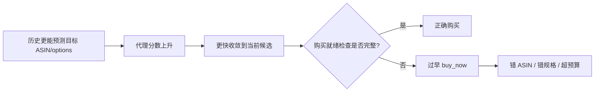

# 项目罗盘与技术叙事

## 1. 项目定位

这是一个端到端 LLM Agent 后训练与信用分配项目。核心价值不在于“复现某篇论文的
最终数字”，而在于完整走通并审计以下链路：

```text
环境契约修复 → SFT 建立能力 → 在线 GRPO → 零梯度组诊断
→ 保守信用分配改造 → 冻结配对评测 → 负结果机制分析
```

推荐方法名：

> TRACE-inspired exact-tie failure-only turn credit for Shopping GRPO

不要称为 faithful TRACE、full TRACE 或 global TRACE。

## 2. 北极星问题

Vanilla GRPO 依赖同一 prompt 下 rollout 的相对终局奖励。当四条轨迹奖励完全相同，
组相对 advantage 为零，该组即使包含不同的搜索与核验行为，也不会贡献有效梯度。

本项目的问题是：

> 在不改变 Reward v3 权威性、不把私有目标暴露给 actor、也不干扰已有终局差异组的
> 前提下，能否为“无成功且精确同分”的失败组提供有界回合信用，提高生成利用率？

## 3. 事实链

### 3.1 SFT 先解决协议能力

Qwen3.5-2B 经过一次 LoRA SFT 后，学会了合法工具调用、多轮页面交互、规格选择和
终局行为。实际训练/验证样本为 1,069/118，训练 loss 为 0.3983。Final-200 上 SFT
严格成功率为 61.5%。

因此，后续 GRPO 的角色不是“从零教会工具使用”，而是在已有能力之上调整约束满足
和决策策略。

### 3.2 Vanilla GRPO 的瓶颈是有效组不足

500 次优化更新需要 1,000 个训练组，但 Vanilla 实际生成 2,270 个组：

- 1,085/2,270（47.80%）为恒定奖励组；
- 773 个是全 gold 恒定组，312 个是恒定非成功组；
- 43 个 sampling-invalid 组被正确过滤；
- 只有 610/1,000 个训练任务至少贡献过一个优化组；
- 最终生成/训练组比为 2.27，利用率为 44.05%。

这是一个明确的信用分配与采样利用率问题。

### 3.3 离线代理审计只支持“有限试验”

Phase 0b 在 20 个同任务 gold/wrong 对上得到 20/20 排序正确，单侧 exact-binomial
`p=9.54e-7`，与终局 utility 的相关为 0.770。它说明目标字符串 log-likelihood 具有
粗粒度端点排序能力，因此允许进入 failure-only smoke。

它不证明每个 prefix delta 都是正确的购物 reward，也不证明 scorer 理解预算、规格、
页面状态和动作合法性。

## 4. 算法罗盘

```mermaid
flowchart TD
    A[四条 rollout + Reward v3] --> B{reward_valid 且可训练?}
    B -->|否| X[丢弃 sampling-invalid / unverifiable]
    B -->|是| C{组内终局 reward 是否有差异?}
    C -->|是| D[Vanilla GRPO advantage]
    C -->|否| E{是否全部 gold?}
    E -->|是| Y[丢弃零梯度成功组]
    E -->|否| F[冻结参考模型计算前缀 log-ratio]
    F --> G[K=3, gamma=0.8 回合信用]
    G --> H[UID 内中心化 + clip [-1,1]]
    H --> I[turn weight 0.2 注入 token advantage]
    D --> J[PPO 更新]
    I --> J
```

### 4.1 设计原则

- **最小干预**：有终局差异的组完全沿用 Vanilla GRPO；
- **失败限定**：只救援 exact-tie 且无购买成功的有效组；
- **私有目标隔离**：scorer target 仅在训练端使用，不进入 actor observation；
- **有界信号**：回合信用先组内中心化，再裁剪到 `[-1,1]`；
- **终局权威不变**：Reward v3 仍决定成功、失败与采样有效性。

### 4.2 与论文 TRACE 的差异

1. 本项目只处理 exact-tie failure groups，而非所有轨迹；
2. eligible 组的组相对 outcome advantage 为零，terminal fill 在数值上不起作用；
3. 本项目额外做 UID 内中心化与裁剪；
4. group size 为 4、prompt batch 为 2、LoRA rank 为 16；
5. scorer 目标是结构化 ASIN/options，而不是短答案；
6. 购物成功是有状态、带硬约束且包含不可逆购买动作的环境结果。

## 5. 实验闸门

| 阶段 | 进入条件 | 结果 | 决策 |
|---|---|---|---|
| Phase 0 | 数值有限、端点方向合理 | alternative-vs-wrong 无可用同任务对 | `no_go` |
| Phase 0b | 同任务 gold/wrong 配对 | 20/20，`p=9.54e-7`，相关 0.770 | 允许 bounded smoke |
| 50-step smoke | 无 NaN/OOM、信用与 batch 合法 | 50/50 update，ratio 1.76 | 允许 500-step run |
| 500-step run | 稳定 PPO、checkpoint 正常 | 500 update，无数值失败 | 用验证集选 step 450 |
| Final-200 | 协议冻结、模型独立服务 | 600/600 done 且 reward valid | 只用于最终结论 |

## 6. 结果罗盘

### 6.1 过程指标：成立

| 指标 | Vanilla | TRACE | 结论 |
|---|---:|---:|---|
| 生成/训练组比 | 2.270 | 1.806 | 降低 20.4% |
| 生成轨迹 | 9,080 | 7,224 | 同等训练组少 1,856 条 |
| 跳过更新尝试 | 56 | 17 | 降低 69.6% |
| 训练利用率 | 44.05% | 55.37% | 提高 11.32 pp |
| PPO KL mean | 0.00753 | 约 0.00659 | 两臂均稳定 |

可得结论：failure-only 信号确实挽救了部分原本会被丢弃的失败组。

不可得结论：没有完整端到端计时，因此不能把 20.4% 的 rollout 减少等同于 20.4%
的 GPU-hour 或 wall-clock 节省。

### 6.2 质量指标：不成立

| 模型 | 严格成功 | Mean Reward v3 | Mean steps |
|---|---:|---:|---:|
| SFT | 61.5% | 0.465843 | 8.115 |
| Vanilla step 450 | 63.0% | 0.490607 | 7.540 |
| TRACE step 450 | 61.5% | 0.464110 | 7.950 |

TRACE vs Vanilla 为 `-1.5 pp`，3 gain / 6 loss，exact McNemar `p=0.508`。区间跨越
零，因此没有统计支持的严格成功率增益。

50 题验证集上 TRACE step 450 的 mean reward 比 Vanilla 高 8.34%，但该差异没有
迁移到 Final-200，不能写成“准确率提升 8.34%”。

## 7. 负结果的机制解释



TRACE 相比 Vanilla：

- repeat loop：13 → 7；
- Guard 拒绝：61 → 32；
- `back_to_search`：21 → 3；
- 购买：186 → 192；
- 错误购买：19 → 25；
- 预算失败：17 → 23。

这说明“循环减少”并不自动等于“能力提高”。模型可能只是更早对第一个合理候选做出
不可逆承诺。当前代理缺少类别 gate、预算、完整规格、证据充分性、当前页面可达性和
动作合法性。

## 8. 工程事故与修复

首次三模型评测出现完全相同结果。原因不是训练无效，而是 veRL export 在输出根目录
恢复了未改变的 SFT 基座，把学习到的权重留在 `lora_adapter/`；vLLM 只服务了根目录。

证据是三个错误服务目录的主权重 SHA-256 与 SFT 完全相同，而 Vanilla 和 TRACE
adapter 的哈希不同。正确流程是：

1. 用 veRL export 恢复 adapter；
2. 用合并后的 SFT 模型作为 base，执行 PEFT `merge_and_unload`；
3. 服务独立 `*-deploy` 目录；
4. 为每个模型设置唯一 served name，使身份错误 fail closed。

无效的首次结果不得报告。

## 9. 结论边界

### 已支持

- Environment/Reward 修复后的端到端 Agent 后训练流水线；
- Vanilla 恒定奖励组与采样浪费诊断；
- 有界、冻结参考模型、K 步 failure-only 信用实现；
- 同等训练组下更高的生成利用率；
- LoRA export 身份故障的发现与修复；
- 冻结 Final-200 配对评测与轨迹级负结果分析。

### 未支持

- TRACE 显著提高 Final-200 成功率；
- TRACE 在任务质量上击败 Vanilla 或 SFT；
- faithful/global TRACE 复现；
- rollout 降低等于同比例算力节省；
- 单次 50 题验证提升等于泛化；
- fewer loops/guards 单独代表更强购物能力。

## 10. 后续方向

当前 Final-200 已被观察。任何进一步方法迭代都必须建立新的 development/test split。
更合理的 potential 应分解建模：

- target/candidate identity；
- category hard gate；
- 完整 variant price 与 budget；
- required option-axis completion；
- evidence completeness；
- current-page reachability 与 action legality；
- continue exploration 与 permit-`buy_now` 的决策。

关键原则是：`buy_now` 必须继续由 Reward v3 的购买就绪条件锚定，不能仅因为目标字符串
更可预测就被鼓励。
